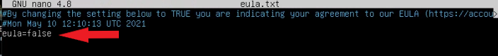
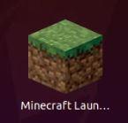

# How to install a Minecraft Dedicated Server

-----
## Table of Contents
- [How to install a Minecraft Dedicated Server](#how-to-install-a-minecraft-dedicated-server)
  - [Table of Contents](#table-of-contents)
  - [Project Description](#project-description)
  - [Requirements](#requirements)
      - [Virtual Machine Specs](#virtual-machine-specs)
  - [Setting Up The Server Environment](#setting-up-the-server-environment)
    - [Getting your VM ready](#getting-your-vm-ready)
      - [Step 1 - Updating your server](#step-1---updating-your-server)
      - [Step 2 - Installing Java](#step-2---installing-java)
      - [Step 3 - Creating a user account for minecraft server](#step-3---creating-a-user-account-for-minecraft-server)
      - [Step 4 - Creating a Minecraft server directory](#step-4---creating-a-minecraft-server-directory)
      - [Step 5 - Download & Configure Minecraft Server](#step-5---download--configure-minecraft-server)
  - [End User License Agreement](#end-user-license-agreement)
      - [Step 6 - Install & Configure Screen](#step-6---install--configure-screen)
      - [Step 7 - Configuring the firewall](#step-7---configuring-the-firewall)
  - [Configuring the Minecraft Client](#configuring-the-minecraft-client)
      - [Step 8 - Installing/Configuring to the Minecraft client](#step-8---installingconfiguring-to-the-minecraft-client)
  - [Conclusion](#conclusion)
  - [Difficulties Encountered](#difficulties-encountered)
  - [Work Reference](#work-reference)

-----

## Project Description
In this document, I will demonstrate how to install and configure a Minecraft dedicated server on a Linux Distribution. Linux is a perfect choice for establishing a Minecraft server since it is known for its stability and reliability for server support. The Linux distribution I have chosen is Ubuntu 20.04 LTS. This server configuration will allow you to host Minecraft players under your local area network. Perfect for host a Minecraft LAN party. 

Follow along as we will give you a step by step procedure of setting up and running your Minecraft server.

----

## Requirements
For this project I will be using a virtual machine hosted on a Windows 10 Pro Operating System.

  *Requirements for my configuration*
* A Virtual Machine application
* Linux Distribution: Ubuntu Server 20.04
* A Minecraft account with access to the Java Edition
* An Active internet connection

The virtual machine I used was created with VM Virtualbox.
If you need help setting up a VM using virtualbox, [follow this tutorial.](https://www.youtube.com/watch?v=PhErfLCd7OQ)  

#### Virtual Machine Specs

The minimum hardware recommendation for a server hosting 3-5 players:

| Minimum Requirements | My Configuration |
---------------------|-----------------
| RAM: 5 GB RAM        | 5 GB RAM   |
| CPU: Intel core-based CPU @ 2.0 GHz and better| Intel Core i5-3570K @ 3.40 GHz |
| HDD: 18 GB empty space | 20 GB empty space |

  
[Check out other minimum requirements for different dedicated builds](https://minecraft.fandom.com/wiki/Server/Requirements/Dedicated)

## Setting Up The Server Environment
### Getting your VM ready

We will be installing a GUI and Java as well as other softwares we will need to successfully implement the Minecraft server. 

#### Step 1 - Updating your server 

As a rule of thumb, ensure your Ubuntu OS is up-to-date before installing new packages. If you installed Ubuntu Server and booted the VM up. Once you log into your user account, you will be on the Ubuntu terminal. Execute the following commands.

` sudo apt update `
` sudo apt upgrade `

* Installing a GUI (Optional)
We will be installing the Ubuntu Desktop User Interface by executing the following command.

` sudo apt-get install ubuntu-desktop `

#### Step 2 - Installing Java

A Minecraft server will require Java Runtime Environment. 
OpenJDK is an open source codebase that almost all other JDKs are built on. For this project we will be using openjdk-8 Java.
Execute the following commands.

` sudo apt install openjdk-8-jdk `

You can confirm the version of Java running by executing the following command.
` java -version `

#### Step 3 - Creating a user account for minecraft server
*replace "enter_username" with you own user name*

- We will be creating a minecraft user for the server
  ` sudo adduser enter_username `

- Adding account to sudo group
   ` sudo usermod -aG sudo enter_username `

- Switching to the new user account for minecraft server
   ` su - enter_username `

#### Step 4 - Creating a Minecraft server directory

Now we will be creating a Minecraft directory to store all of our Minecraft files. Execute the following command to create the directory.

` mkdir Minecraft `

  
We will be downloading the Minecraft server file to this new directory. Change to the Minecraft directory by executing the following command.
  
` cd Minecraft `

#### Step 5 - Download & Configure Minecraft Server 

Downloading Minecraft server 
Check on https://www.minecraft.net/en-us/download/server for the latest version
  - Version at the time of this document is version 1.16.5.

To download directly from the terminal, execute the following command

` wget -O server.jar https://launcher.mojang.com/v1/objects/1b557e7b033b583cd9f66746b7a9ab1ec1673ced/server.jar `

The file will download with "server.jar" as its name.
Rename the file to match its version with the following command

`mv server.jar minecraft_server_1.16.jar `

We will make the .jar file executable by executing the following command

` sudo chmod +x minecraft.server_1.16.jar`

Now we can execute the .jar file

` java -Xmx1024M -Xms1024M -jar minecraft.server_1.16.jar `

  - We are specifying how much memory we want the file to use and the max memory we are allowing it to use. In this case we are setting both at 1 GB RAM.

We will get an initial error (Shown below) 

## End User License Agreement

We need to accept the End User License Agreement before getting started with minecraft. The files we need to view will be generated for us in the working directory. Run the "ls" command and there should be two new files called "eula.txt" and "server.properties" in our working directory. 

* Using a text editor we will view the EULA.txt file.

` nano eula.txt `

* Set the EULA parameter to true. Save and close the file.

* Now we will view the Server properties.

`nano server.properties `

In this file we will only perform some of the primary configuration as listed below. 

    * gamemode=survival – This option sets the gameplay mode. Other options include creativity, adventure, and spectator.
    * difficulty=easy – This option sets the difficulty of the game. Other options include peaceful, normal, and hard.
    * pvp=true
    * level-name=world
    * motd=joshlinuxserver: This is the name of your Minecraft server that will be listed in the servers list.

We have now configured both the eula.txt and server.properties file. 
But before we re-run the command to start the server, let install Screen.

* Change out of the minecraft directory using the 'cd' commands

` cd ` 

#### Step 6 - Install & Configure Screen

Screen will enable the Minecraft server to run as a background process. By not using Screen, if you were to start the Minecraft server in the terminal and later close the terminal, that would automatically kill the server. With Screen, the server will continue to run in the background. 

Execute the commands below.
 - If screen is already installed, skip the install

` sudo apt install screen `

* Launch a Screen session using the screen command.

` screen `

Screen is now running.
* Press the space bar, and the terminal will show standard terminal window again. 

Now we can re-run the following command

` java -Xmx1024M -Xms1024M -jar minecraft_server.1.16.1.jar nogui `

Now the Minecraft server will start preparing spawn area.
Once the server has finished executed and is successfully running on the system, you will see the output below. 

` [Server thread/INFO]: Done (30.762s)! For help, type "help" `

At this point we have Minecraft server up and running and you are in admin control panel.
Type "help" command which listed options I can set from here. 

In the current Minecraft session on the Terminal, use the Ctrl-A + Ctrl-D key sequence.

Now we need to identify the ID of our Minecraft session running on Screen. 
Run the -list command below.

` screen -list `

From the output we can identify the Minecraft session as 2552. 
To resume this session, use the -r parameter as in the command below. 
  - Replace #### with the servers 4 digit session number

` screen -r ##### ` 

To log out or close the Terminal, be sure to use the sequence Ctrl-A + Ctrl-D to detach your Minecraft screen. This will keep the session running in the background. 

#### Step 7 - Configuring the firewall

Once we have installed the required items, we now need to configure the firewall. 

Since I will be using a separate VM in my network to log into the Minecraft server, I need to allow incoming connections from minecraft through port 25565 *(default)*

* Execute the following command to add a new firewall rule.

` sudo ufw allow 25565 `

Now that we have the firewall configured and the necessary packages, we can now allow clients to connect to the Minecraft server. 

## Configuring the Minecraft Client

We will be working on another VM separate from the VM hosting the Minecraft Server.

#### Step 8 - Installing/Configuring to the Minecraft client

We will require Minecraft Java Edition. 

You can download he .deb file from [here](https://www.minecraft.net/en-us/download/server/)

* Assuming the file has been downloaded to your downloads, execute the following command to install the .deb

` sudo dpkg -i ~/Downloads/Minecraft.deb `

* The Minecraft launcher should be visible in your applications list.

Launch the application

* Select Multiplayer on the title menu

* Select "Add Server" from the options

* Input the Minecraft server information
  * Server Name:  
  * Server address: 
Hit done

The server should now appear on the list of servers available

You should be able to join the server. 

If you check on the Minecraft server, you will see a notification
stating the user as joined the game... and died in this case.

## Conclusion

We have successfully installed a Minecraft server and can host your own server for 3-5 of your minecraft friends. 

## Difficulties Encountered 

**Minecraft client does not connect to server / VM Sharing the same IP address inside of virtual box manager**

(Issue only when creating two VM under the same network)

During the client to server connections, I encountered an issue in which I was unable to connect to the minecraft server. I realized both the MC-Client-VM and the MC-Server-VM shared the same IP address. 
Each machine should have their own respective IP address to establish a connection. Otherwise, server will appear as pictured below. 

> Solution:
Within VirtualBox Manager go to the virtual machine hosting the server software. Right-click the VM > Settings > Network. Inside the Adapter 1 tab, from the drop-down, select Bridged Adapter. Hit Ok.

Restart the Virtual Machines

## Work Reference 
"Installing Ubuntu Server 20.04" - https://www.youtube.com/watch?v=PhErfLCd7OQ

"Minecraft Server Tutorial" - https://minecraft.fandom.com/wiki/Tutorials/Setting_up_a_server

Visual guide by KeepItTechie- https://www.youtube.com/watch?v=lqaaNvHBYqM

