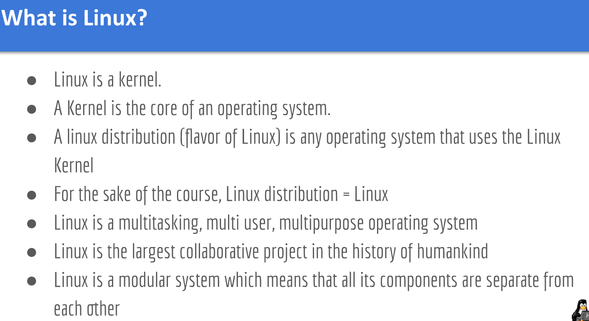
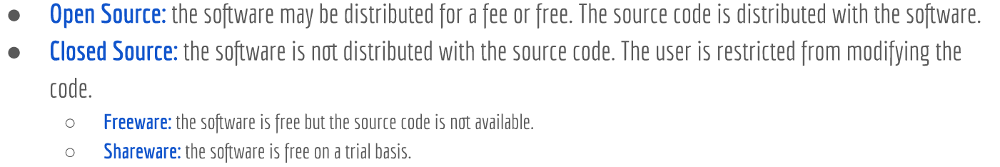
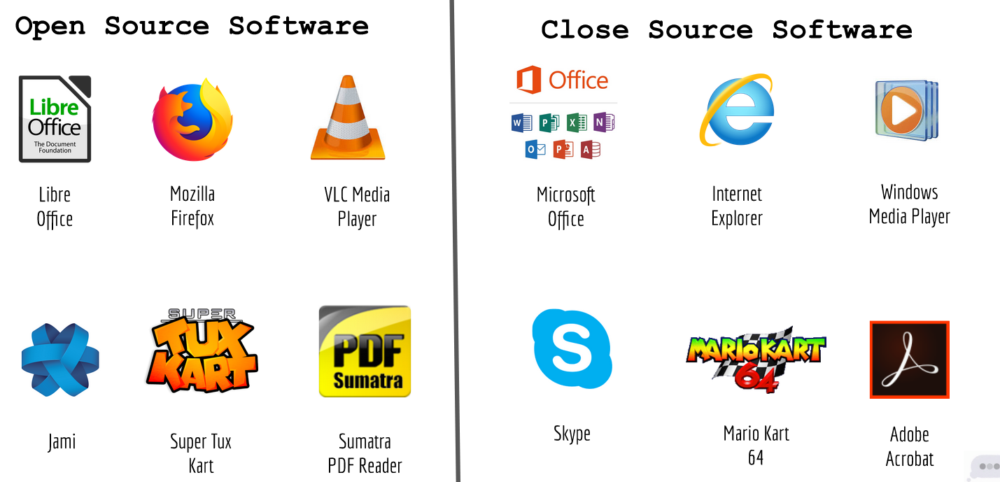

## Lecture Note 1

Linux is an open Source operating system based on the Linux kernal. 
A linux Distribution is any operating system that uses the linux kernal.
 - There are many different distribution that can fit the needs of the end-user. 
        - The main distributions out are RedHat and Debian

Open source = Software that is free. Code is freely available on the internet.
Closed source = Software which the code is not available/restricted.

Examples of Open and Closed source softwares.

There are 4 different types of freedoms. 
- Freedom 1: run the program as you wish
- Freedom 2: Study how the program works and change it as you wish
- Freedom 3: Freedom to distribute your modified program as you wish

Distribution we will use in this class is Ubuntu. 
Ubuntu is available for community and professional support. 
        - There are different versions of Ubuntu.

---- What to expect from the class ----
• Installing Ubuntu in a Raspberry Pi
• Updating Ubuntu
• Managing Software in Ubuntu
• Exploring the Desktop Environment
• Gnome 3 vs Gnome Classic
