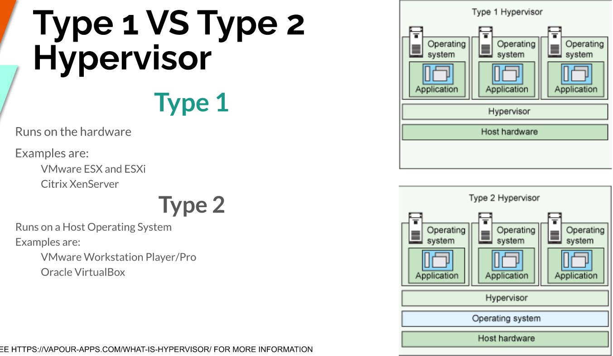

## Lecture 2 Notes

#### What is Virtualization?

**The basics:**
Running a virtual instance of a computer system inside a physical machine.
Two types of Virtualization:
    - Server Side
    - Client Side
Difference between the two is where the virtualization takes place. 

**Server side Virtualization**
Server side virtual desktop infrastructure (VDI):
    - Think client or fat client
    - Thin client
    - Zero Client

**Client-side virtualization**
    - Software installed on a PC to manage a VM and each VM will have its own OS installed. 
For client side virtualization, you will need a hypervisor which is a software that allows the management of VMs and hardware to support the VMs.

**Types of Hypervisors**

---
**What is virtualbox?**
VirtualBox is a type 2 virtualization product.
It is open source software under the GPL version 2 license. 

It can run on Windows, Linux, Mac and Solaris.

**What is a Raspberry Pi?**
Raspberry Pi is a series of small single-board computers developed in the United Kingdom by the Raspberry Pi Foundation in association with Broadcom. The Raspberry Pi project originally leaned towards the promotion of teaching basic computer science in schools and in developing countries.

Can buy it in microcenter for 100 bucks. 

