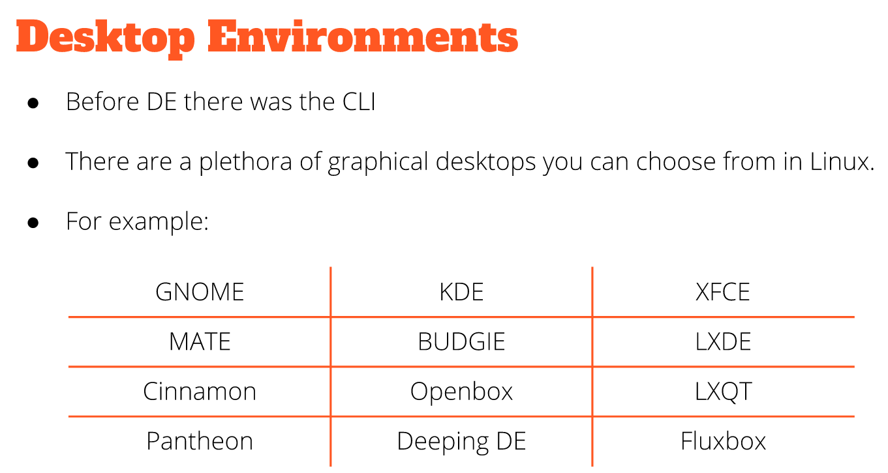
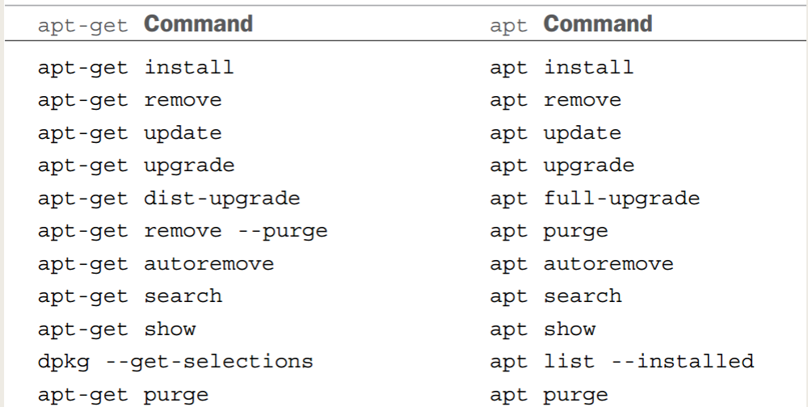
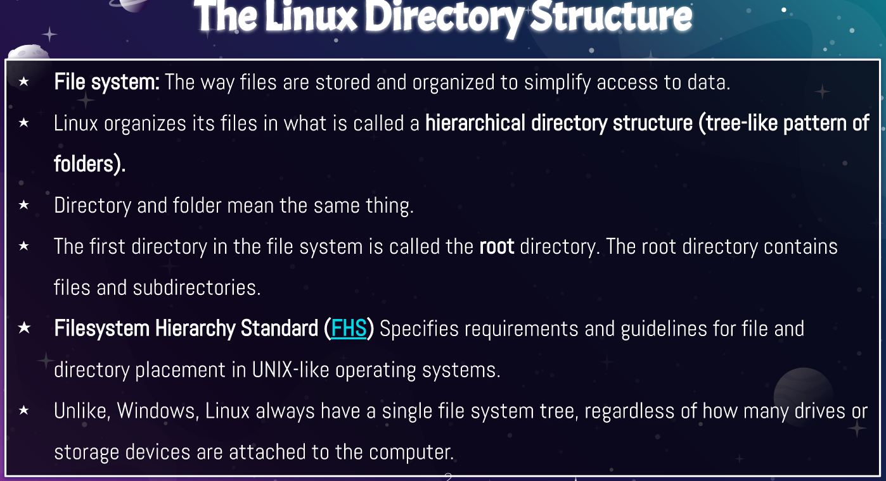

Lecture 3 Notes

**GUI**: A graphical user interface is a set of programs that allow users to interact with the computer system.

**DE**: Desktop Environment is an implementation of the desktop metaphor

On windows and mac, a user is limited to a single GUI/DE.
But in linux, there is a large variety of choices.

- Ubuntu is a GNOME3.

---
**Installing software in Linux**:

*sudo apt install "Package Name"*

**Searching for software in Linux**:

*apt search "Key word"*

**The Linux filesystem**

https://www.tecmint.com/top-best-lightweight-linux-file-managers/