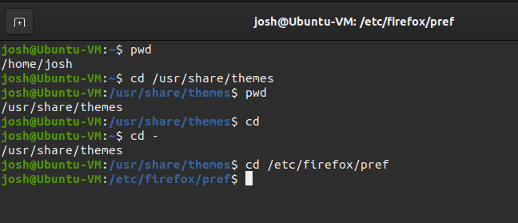
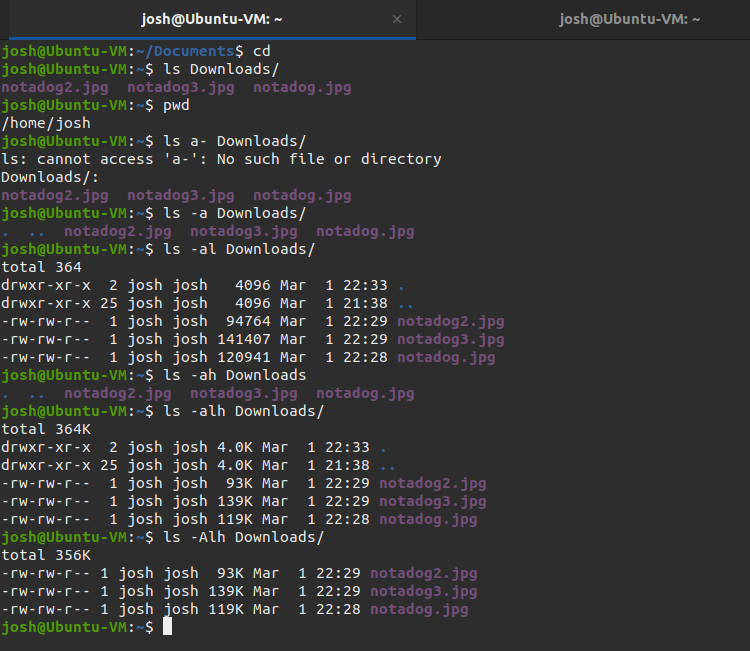
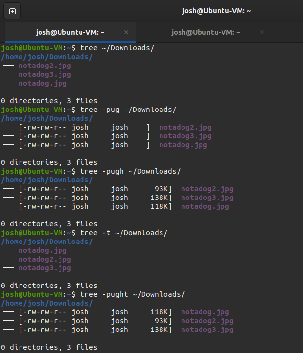
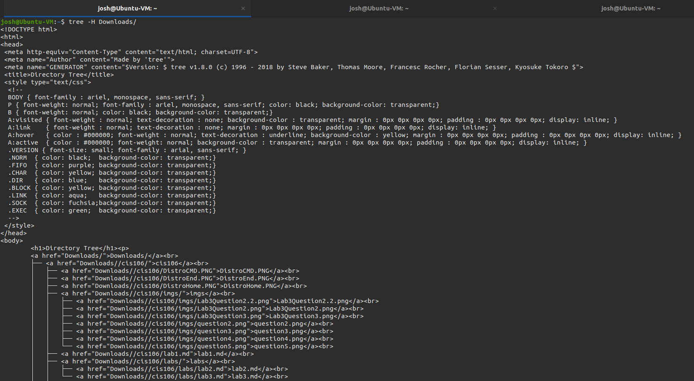
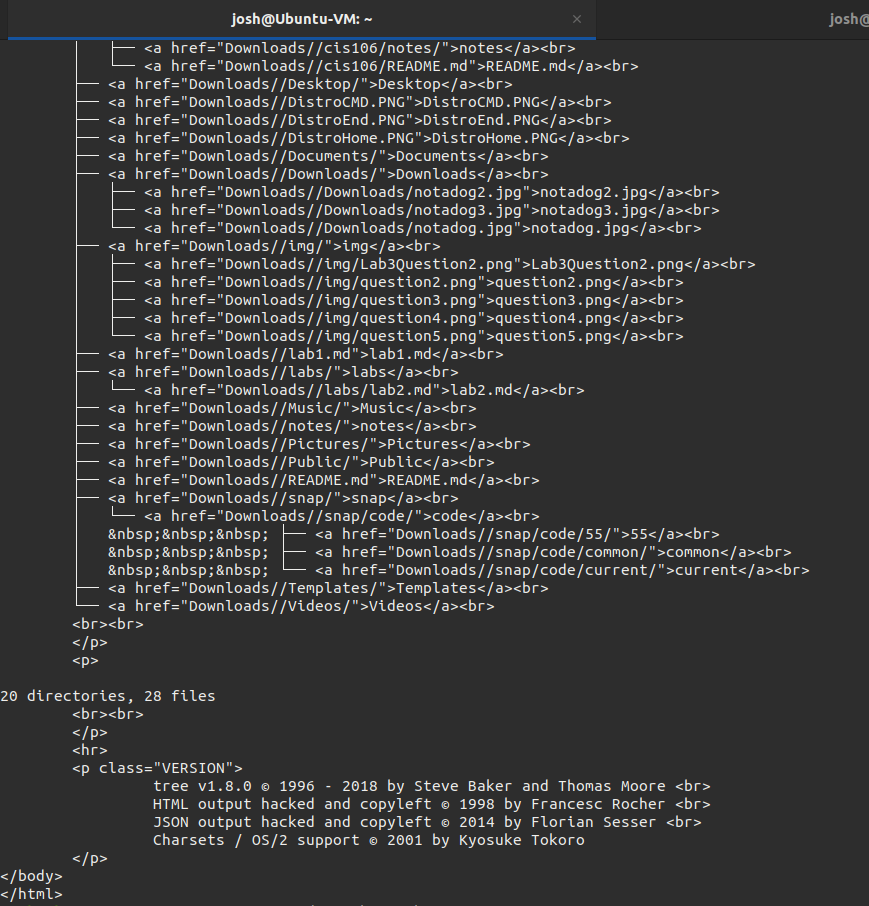
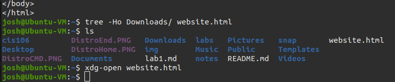
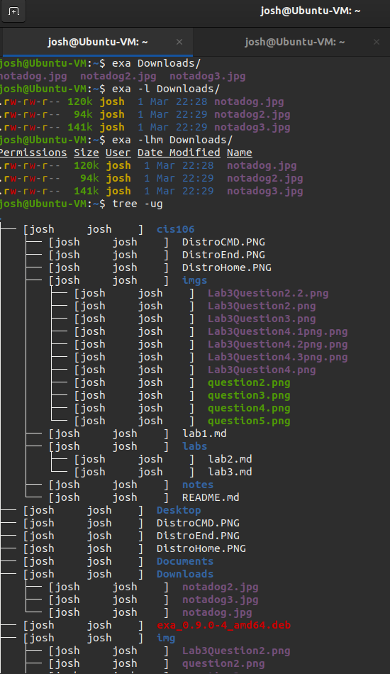
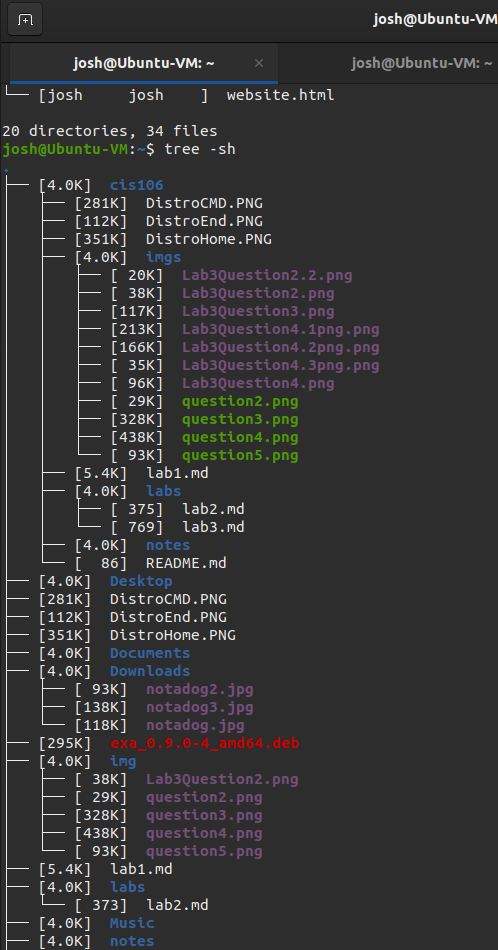

# Lab 3 | Installing software and navigating the file system | Answers
Assignment description [here](https://raw.githubusercontent.com/ra559/cis106/main/labs/lab3.md)

## Question 1

1. Which command did you use to search for the themes and to install them?

* To search all themes use
  >  apt search theme
* to install specific theme
  >  sudo apt install < ThemeName >

1. Which commands did you use to find and install the web browser?
* To search for all browsers use
   > apt search browser
* To install browser
   > sudo apt install onionshare

3.1 What is the name of the package?
   * onionshare

3.2 What dependencies are needed in order to install the package? (you can either take a screenshot of the terminal or copy and paste from the terminal)
   > The following additional packages will be installed:
  libqt5designer5 libqt5help5 libqt5printsupport5 libqt5sql5
  libqt5sql5-sqlite libqt5test5 libqt5xml5 obfs4proxy python3-flask
  python3-flask-httpauth python3-itsdangerous python3-jinja2
  python3-pyinotify python3-pyqt5 python3-sip python3-socks python3-stem
  python3-werkzeug tor tor-geoipdb torsocks

 
3.3 How much disk space will the package utilize after installation?
  > 0 upgraded, 22 newly installed, 0 to remove and 0 not upgraded.
Need to get 11.4 MB of archives.
After this operation, 50.7 MB of additional disk space will be used.

## Question 2 | The pwd and cd command

## Question 3

## Question 4

## Question 5

