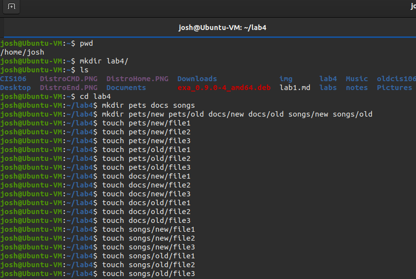
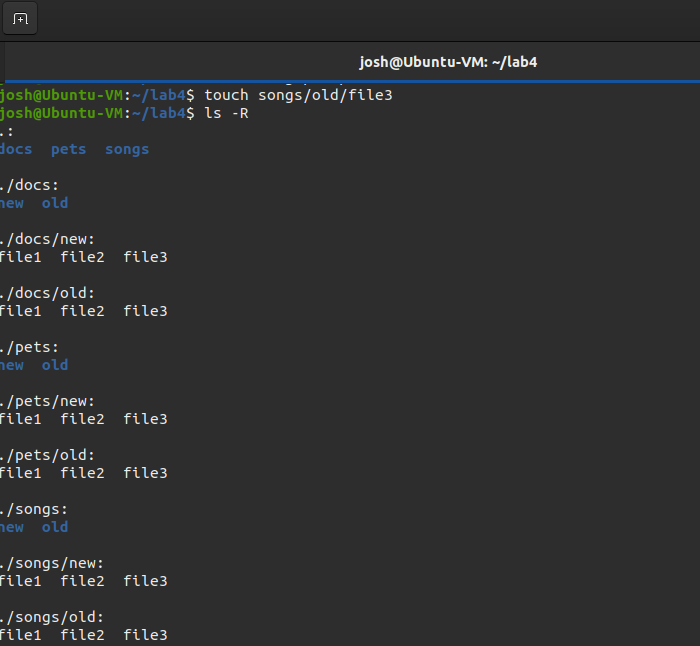
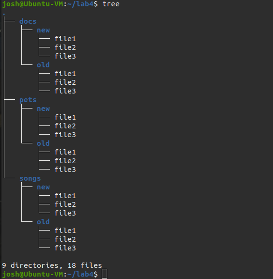
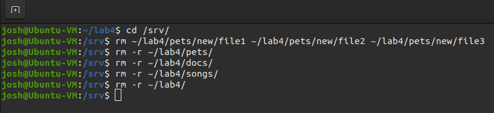
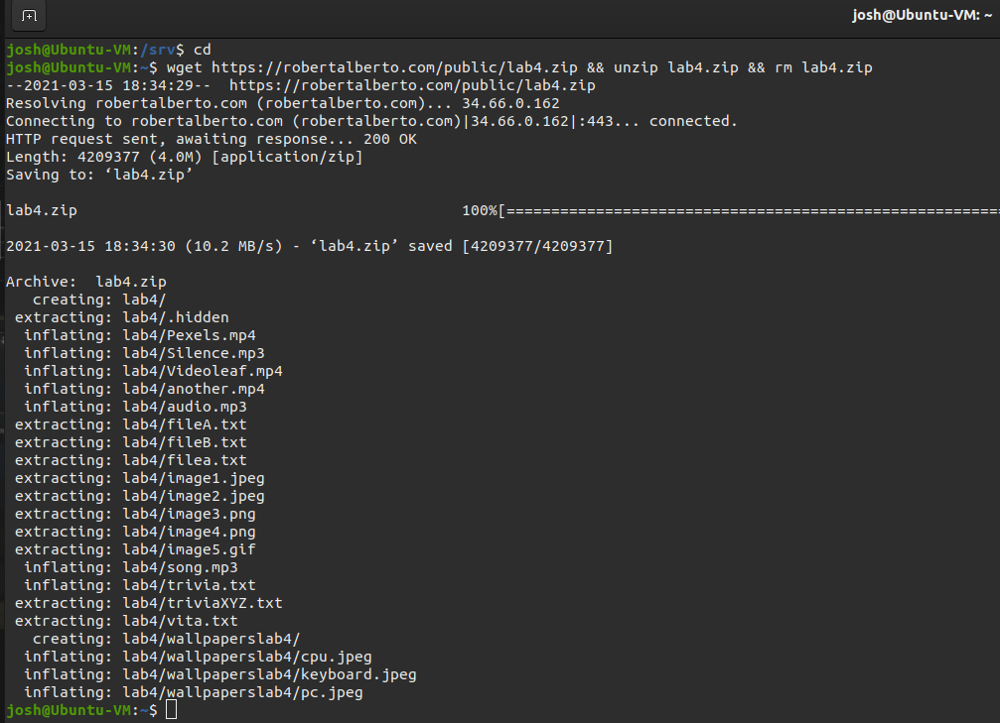
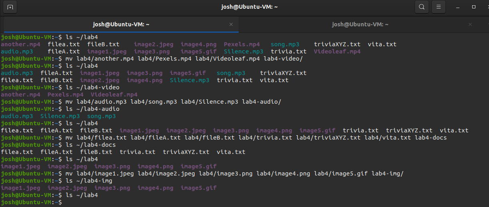
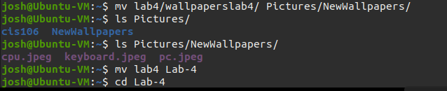
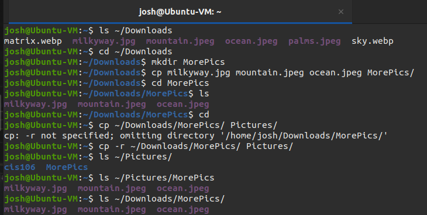

## Question 1: Creating Files and Directories
#### 1, 2, 3

#### 4

#### 5

## Question 2: Removing Files and Directories
#### 1-5

 
## Question 3: Moving Files and Directories
#### 1

#### 2-3

#### 4-5

## Question 4: Copying Files and Directories
#### 1-4

#### 5
