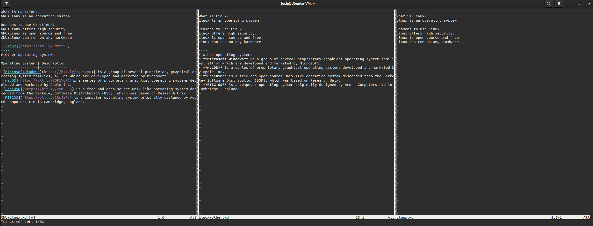

# Lab 6 | Using VIM

## Question 2
Vm Screenshots of all 3 files

Files: 
[Linux.md](https://github.com/Joshrive/cis106/blob/main/imgs/Lab6/Linux.md)
[Linux+other](https://github.com/Joshrive/cis106/blob/main/imgs/Lab6/Linux%2Bother.md)
[GNU-Linux](https://github.com/Joshrive/cis106/blob/main/imgs/Lab6/GNU%2BLinux.md)

